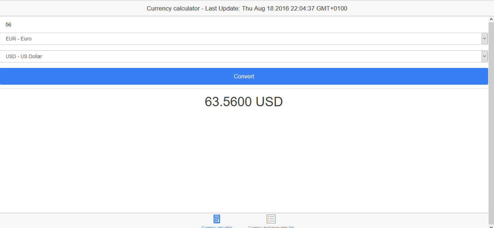
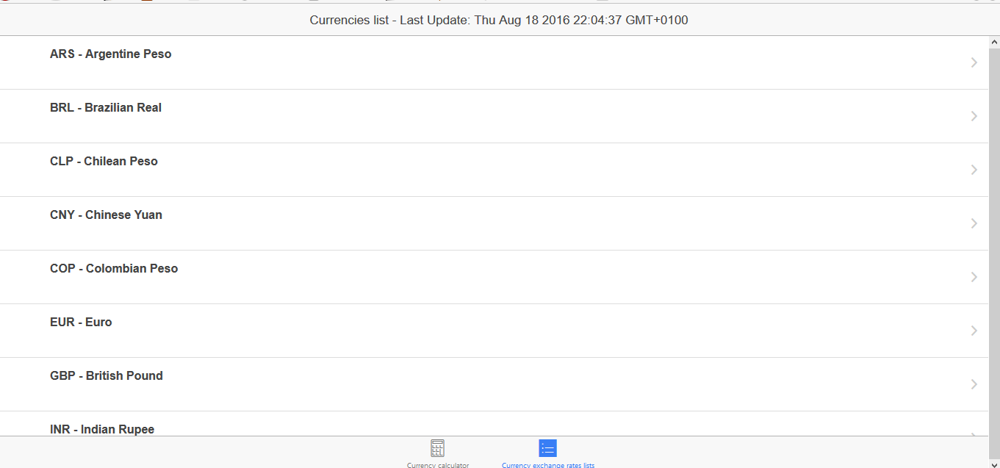
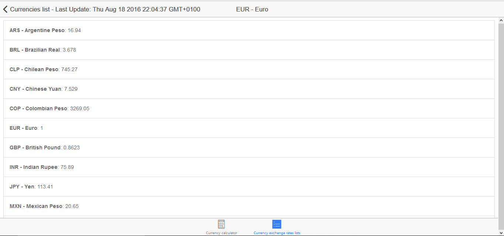

# Currency calculator

A currency calculator web app made on bootstrap and Ionic framework. Part of a little server - client experiment along the [X-rate scraper server](https://github.com/mauriciojorta/X-rates-scraper-server).

## Features

1. A exchange rate calculator for a set of 12 currencies (including the most valuable ones such as the US Dollar, the Euro and the British Pound).
2. A list page with the exchange rates lists of each currency with other coins.

## Screenshots





## Testing the app

Install Ionic in your system.

```sh
$ npm install -g ionic
```

2. Clone, extract and run on your localhost the [X-rate scraper server](https://github.com/mauriciojorta/X-rates-scraper-server) (you'll find the instruction in its repo).
3. Wait for the server to update all currencies (it should take around a minute).
4. Clone and extract this repo. Move inside it.
6. Enter this command to install all required dependencies:

```sh
$ npm install
```

Start the app with this command:

```sh
$ ionic serve
```
The app should open in a random localhost port window in your default browser


